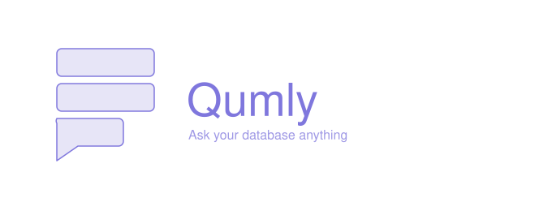

  

## Qumly

An AI-Powered Natural Language SQL Assistant that turns plain English (or your voice) into safe, schema-aware SQL then runs it, shows you the results, and explains what the query actually does.
