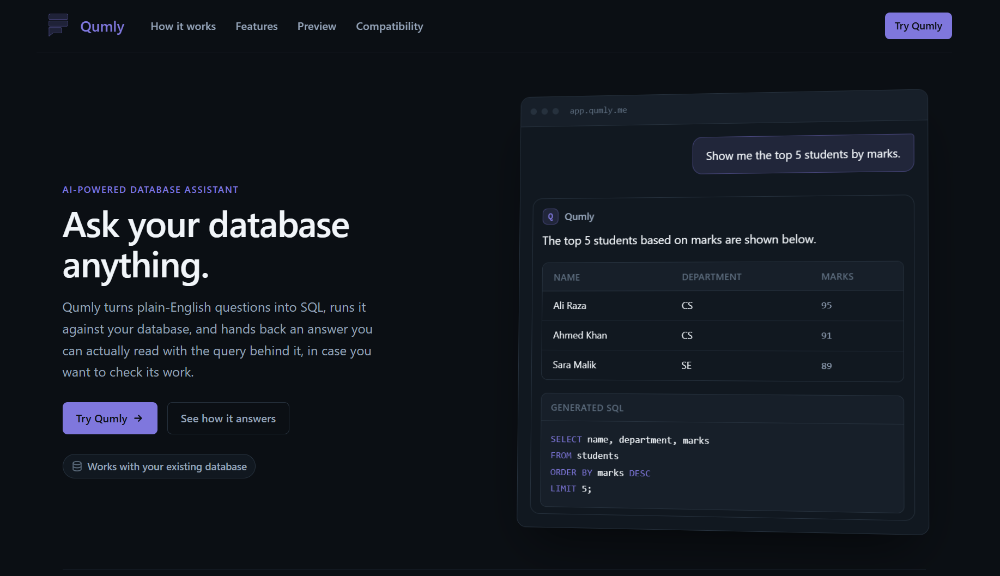
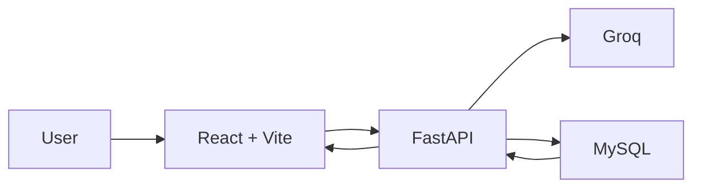

<h1>Qumly</h1>

<p align="center">
  
</p>


<p align="center">
An AI-powered SQL assistant that turns natural language or voice into safe SQL, executes queries, and explains results in plain English.
</p>


<p align="center">
  <a href="https://github.com/alibro005/Qumly/releases"></a>
  <a href="https://github.com/alibro005/Qumly"></a>
  <a href="https://github.com/alibro005/Qumly/issues"></a>
  <a href="https://github.com/alibro005/Qumly"></a>
  <a href="LICENSE"></a>
</p>

<p align="center">
  <a href="https://qumly.me">Live Demo</a> .
  <a href="INSTALLATION.md">Installation</a> .
  <a href="https://github.com/alibro005/Qumly/issues">Issues</a>
</p>

Working with databases often requires knowing SQL, even for simple questions. Qumly provides a natural-language interface for querying MySQL databases without requiring users to write SQL manually.

Qumly uses the connected database schema to generate SQL, validates the query before execution, and keeps the generated SQL visible so users can understand and verify what is being executed.

For example, instead of writing a SQL query manually, you can simply ask:

What were the top 5 best-selling products last month?

Qumly generates and executes the query, then presents the results in a clear, human-readable format.


<p align="center">
  
</p>

---

## Features

| Feature                         | Description                                              |
| ------------------------------- | -------------------------------------------------------- |
| **Natural Language to SQL**     | Generate schema-aware SQL from plain-English questions.  |
| **Voice Queries**               | Ask questions using your voice.                          |
| **SQL Validation & Correction** | Validate and correct generated queries before execution. |
| **Safe Query Execution**        | Restrict execution to read-only SQL operations.          |
| **Human-Readable Answers**      | Get clear explanations of query results.                 |
| **SQL Explanation**             | Understand what the generated SQL does.                  |
| **Clarification Handling**      | Resolve ambiguous questions before execution.            |
| **Charts & Results**            | View results in tables and suitable visualizations.      |
| **Conversation History**        | Continue conversations with previous context.            |
| **MySQL Connections**           | Connect Qumly to your own MySQL database.                |


---

## How Qumly Works



The general flow is:

1. The user asks a question in natural language.
2. Qumly provides the database schema and question to the AI model.
3. The model generates an SQL query.
4. The query is validated for safety and correctness.
5. The validated query is executed against MySQL.
6. The results are returned to the frontend.
7. Qumly generates a human-readable explanation of the result.

---

## Example

A user can ask:

```text
Which department has the highest average student marks?
```

Qumly can generate a query such as:

```sql
SELECT department, AVG(marks) AS average_marks
FROM students
GROUP BY department
ORDER BY average_marks DESC
LIMIT 1;
```

The result is then presented along with an explanation so the user can understand both **what was queried** and **what the result means**.

---

## Tech Stack

| Part            | Technology      |
| --------------- | --------------- |
| Frontend        | React, Vite     |
| Backend         | FastAPI, Python |
| Database        | MySQL           |
| AI              | Groq            |
| Package Manager | uv              |
| Styling         | CSS             |
| Version Control | Git, GitHub     |

---

## Getting Started

For detailed instructions on installing and running Qumly locally, see:

**[Installation Guide](INSTALLATION.md)**

---

## Live Demo

Try the deployed version of Qumly:

**[Qumly](https://qumly.me)**

> The deployed version requires a backend and database that are reachable from the internet. For the complete local setup, see the [Installation Guide](INSTALLATION.md).

---

## Project Status

Qumly is currently in **active development** and is **not production-ready**.

Current development focuses on improving SQL generation, query validation, result explanations, database support, visualizations, and the overall user experience.

---

## Contributing

Contributions, suggestions, and feedback are welcome.

If you find a bug or have an idea for improving Qumly, feel free to open an issue or submit a pull request.

---

## License

Qumly is licensed under the **MIT License**.

See the [LICENSE](LICENSE) file for more information.

---

## Author

**Muhammad Ali Siddiqui**

* GitHub: [@alibro005](https://github.com/alibro005)

---

