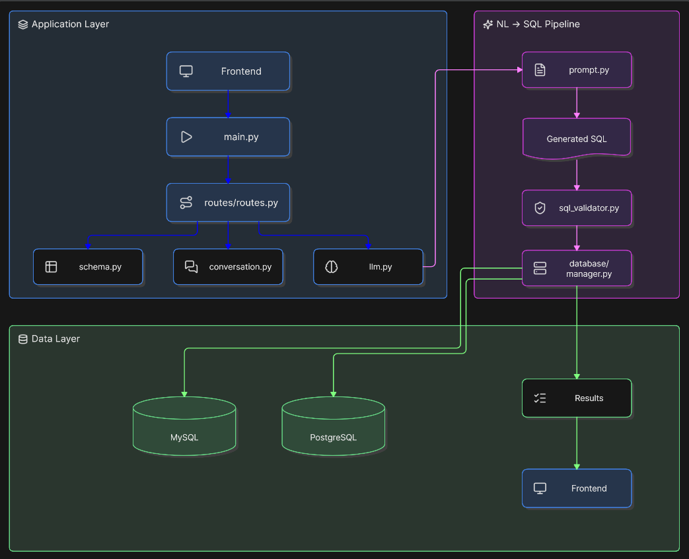
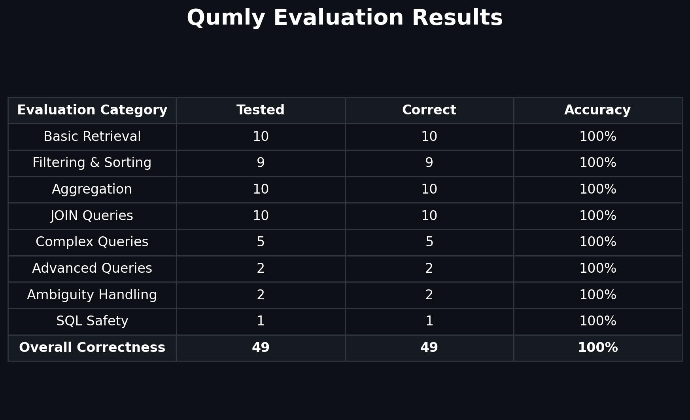

# _Qumly_

  

An AI-powered SQL assistant that turns natural language or voice into safe SQL, executes queries, and explains results in plain English.

  
  
  
  
  

  <strong><em>Self-hosted Version</em></strong> :
  <a href="https://qumly.me">click here</a>

  <strong><em>Installation Guide</em></strong> :
  <a href="INSTALLATION.md">click here</a>

Working with databases often requires knowing SQL, even for simple questions. Qumly provides a natural-language and voice interface for querying databases without requiring users to write SQL manually.

Qumly uses the connected database schema to generate SQL, validates the query before execution, and keeps the generated SQL visible so users can understand and verify what is being executed.

For example, instead of writing a SQL query manually, you can simply ask:

> What were the top 5 best-selling products last month?

Qumly generates and executes the query, then presents the results in a clear, human-readable format.

  

## _Core Capabilities_
- Natural Language to SQL
- Voice-Based Queries
- MySQL & PostgreSQL Support
- Database Schema Inspection
- Human-Readable AI Answers
- Dynamic Result Visualizations
  
## _Why It's Different_

- Schema-Aware Query Generation 
- SQL Validation & Automatic Correction 
- Safe Read-Only Query Execution 
- Clarification Handling
- SQL Preview & Explanation 

## _Impact & Outcomes_

- No Manual SQL Writing
- Faster Data Exploration
- Reduced Querying Complexity
- Improved Query Safety
- Better Understanding of SQL Results
- Accessible Database Interaction for Non-SQL Users

## _Architecture_

  

## _How It Works_

1. User asks a question in natural language or by voice
2. Frontend sends the request to FastAPI
3. Backend retrieves the database schema and conversation context
4. LLM generates a schema-aware SQL query
5. SQL is validated and corrected if necessary
6. Database manager executes the validated query
7. Results and explanations are returned to the frontend

## _Evaluation_

Qumly was evaluated on **49 test cases** using an e-commerce database schema. The evaluation covers SQL generation, database results, filtering, aggregation, joins, complex queries, ambiguity handling, and SQL safety.

  

### _Interaction Efficiency_

Qumly achieved correct database results across all **49 test cases**. One clear query required an unnecessary clarification before generating the correct SQL.

**Interaction Efficiency: 48/49 (97.96%)**

## _Tech Stack_

- React + Vite
- FastAPI
- Python
- Groq
- MySQL
- PostgreSQL
- Git & GitHub

## _Project Status_

Qumly is currently in **active development** and is **not production-ready**.

Current development focuses on improving SQL generation, query validation, result explanations, database support, visualizations, and the overall user experience.

## _Contributing_

Contributions, suggestions, and feedback are welcome.

If you find a bug or have an idea for improving Qumly, feel free to open an issue or submit a pull request.

## _License_

Qumly is licensed under the **MIT License**.

See the [LICENSE](LICENSE) file for more information.

## _Author_

**Muhammad Ali Siddiqui**

* GitHub: [@alibro005](https://github.com/alibro005)

